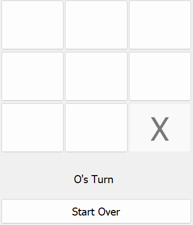

# Tic-Tac-Toe AI

A perfect Tic Tac Toe solution exists without the need of AI. With a skilled opponent, it always ends up in __draw__. But how is that fun? So enjoy a __medium difficulty__ AI that you could kill time with.

There are two ways you can play with my AI:

- AI goes First, AI is 'X'.
- AI goes Next, AI is 'O'.

---

## Technicality

Tic Tac Toe is a small game when we look at its decision depth. Thus using decision trees searching, and a good cost function, any future position can be evaluated.

Decision Tree searching is done using MinMax Algorithm. Where the code could explore all future moves. Depending on Cost Function, a position can be __intentionally mis-evaluated__ to make the AI _dumb_.

---

### Credit

The UI is borrowed from [Codemy's](https://www.codemy.com) Youtube [video](https://www.youtube.com/watch?v=xx0qmpuA-vM) on creating a Tic Tac Toe game in Python Tkinter.
